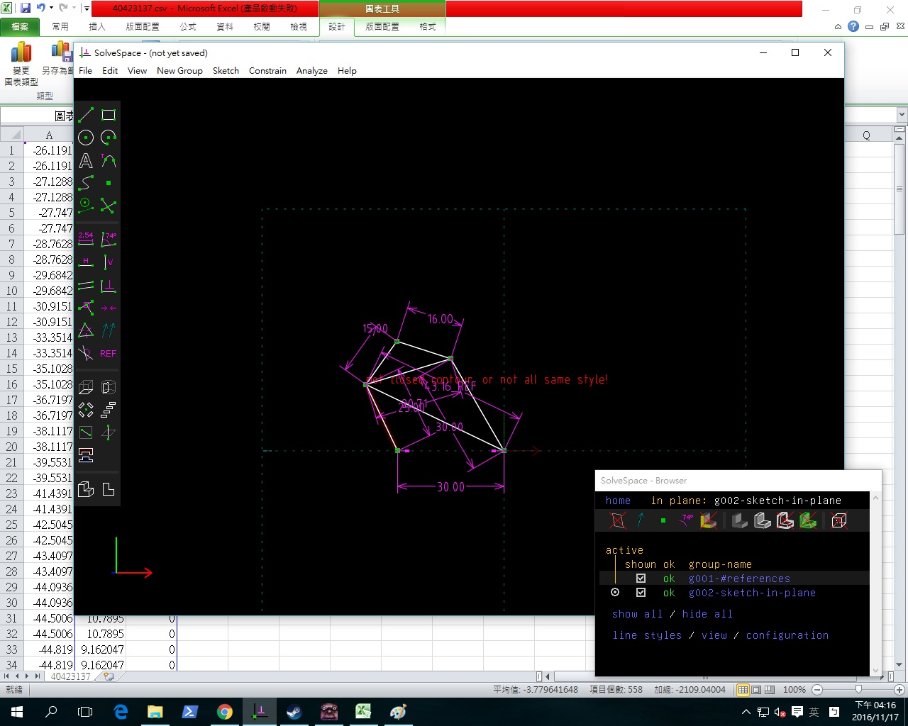
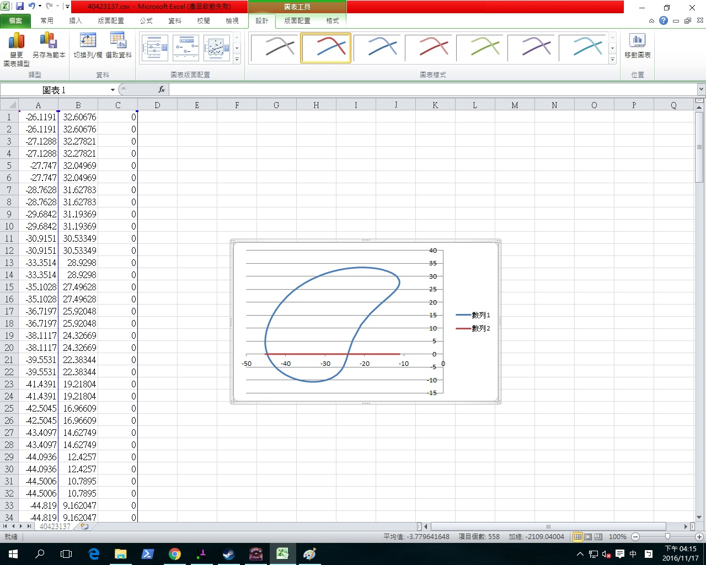

Title: 2017-01-12 電腦輔助設計課程總結
Date: 2017-01-12 
Category: 作業
Tags: 作業
Author: 40423137

<!-- PELICAN_END_SUMMARY -->
2016.09.22 NOTE

1.先到 https://github.com/mdecourse 的 2016cadp 按 Fork

2.在自己的github帳號創立一個 2016fallcadp_hw倉儲 把最下面的 Add.gitignore輸入 Python Add a license輸入 Agpl

3.在 2016fallcadp_hw倉儲 建立gh-pages分支

4.按上方的一個setting-branches-選擇gh-pages

5.在系上的電腦 輸入 140.130.17.17/2016fall 下載近端的python

6.在自己的帳號建立 40423137.github.io 說明打 my home page 把最下面的 Add.gitignore輸入 Python Add a license輸入 Agpl

7.在 40423137.github.io倉儲的左上角有一個 Create new file點進去 新增40423137.github.io.index.html 就會有自己的網頁了

8.進入 https://github.com/mdecourse/2016fallcadp/wiki 的上課筆記 
下載繪圖軟體練習零件繪製: http://solvespace.com/bracket.pl

2016.10.06

機械設計系的目標:

培養具創造力 精通表達

能積極配合 偕同產品設計流程的機械設計工程師

創造力=自學力+程式力+想像力

表達=oral,text,2D,3D,analytical,physical

協同產品設計=computer,network,tools,project

工業4.0=客製化,體貼

設proxy=proxy.mde.tw 3128

近端裝pelican: pip install pelican

2016.10.09Solvespace 四連桿機構

<blockquote class="imgur-embed-pub" lang="en" data-id="Fbu0wmA"></blockquote>

Solvespace 四連桿圖檔:

<a href="./../w7/40423137.csv">40423137.csv</a> (請以滑鼠右鍵存檔)

<a href="./../w7/40423137.slvs">40423137.slvs</a> (請以滑鼠右鍵存檔)

2016.11.17

<iframe src="https://player.vimeo.com/video/185637996" width="640" height="360" frameborder="0" webkitallowfullscreen mozallowfullscreen allowfullscreen></iframe>

<a href="https://vimeo.com/185637996">製圖作業</a> from <a href="https://vimeo.com/user45109608">TommyGWOW</a> on <a href="https://vimeo.com">Vimeo</a>.

2016.11.24

<h2>Solvespace 平面四連桿機構模擬</h2>

直接利用 Solvespace Analyze-Trace Point-Stop Trace 得到下列繞行路徑:

將所得到的點座標 .csv 以 Excel 畫圖, 得到:

Python3 平面四連桿機構模擬:

Ubuntu 安裝 matplotlib:

sudo apt-get install python3-matplotlib

<pre class="brush: python">

2016.12.01

## Solvespace 組合圖
<iframe src="./../w7/404231051201.html" width="800" height="600"></iframe>

2016.12.08

<iframe src="https://player.vimeo.com/video/190880297" width="640" height="360" frameborder="0" webkitallowfullscreen mozallowfullscreen allowfullscreen></iframe>

<a href="https://vimeo.com/190880297">3</a> from <a href="https://vimeo.com/user45109608">TommyGWOW</a> on <a href="https://vimeo.com">Vimeo</a>.

<iframe src="https://player.vimeo.com/video/190880264" width="640" height="360" frameborder="0" webkitallowfullscreen mozallowfullscreen allowfullscreen></iframe>

<a href="https://vimeo.com/190880264">2</a> from <a href="https://vimeo.com/user45109608">TommyGWOW</a> on <a href="https://vimeo.com">Vimeo</a>.

<iframe src="https://player.vimeo.com/video/190880224" width="640" height="360" frameborder="0" webkitallowfullscreen mozallowfullscreen allowfullscreen></iframe>

<a href="https://vimeo.com/190880224">5</a> from <a href="https://vimeo.com/user45109608">TommyGWOW</a> on <a href="https://vimeo.com">Vimeo</a>.

## onshape 作業

2016.12.20 3D印表機

## 自製3D列印機零件
## 支柱
<iframe src="./../w7/3d/20161217-1.html" width="800" height="600"></iframe>
## 連接桿
<iframe src="./../w7/3d/20161217.html" width="800" height="600"></iframe>
## 底盤
<iframe src="./../w7/3d/20161217-5.html" width="800" height="600"></iframe>
## 圓盤
<iframe src="./../w7/3d/20161217-3.html" width="800" height="600"></iframe>

## 自製3D列印機
<iframe src="./../w7/3d/20161217-2.html" width="800" height="600"></iframe>

<iframe src="https://player.vimeo.com/video/199436781" width="640" height="360" frameborder="0" webkitallowfullscreen mozallowfullscreen allowfullscreen></iframe>

<a href="https://vimeo.com/199436781">3DP組合</a> from <a href="https://vimeo.com/user45109608">40423137</a> on <a href="https://vimeo.com">Vimeo</a>.

<iframe src="https://player.vimeo.com/video/199436793" width="640" height="360" frameborder="0" webkitallowfullscreen mozallowfullscreen allowfullscreen></iframe>

<a href="https://vimeo.com/199436793">3DP</a> from <a href="https://vimeo.com/user45109608">40423137</a> on <a href="https://vimeo.com">Vimeo</a>.

<iframe src="https://player.vimeo.com/video/199436800" width="640" height="360" frameborder="0" webkitallowfullscreen mozallowfullscreen allowfullscreen></iframe>

<a href="https://vimeo.com/199436800">Untitled</a> from <a href="https://vimeo.com/user45109608">40423137</a> on <a href="https://vimeo.com">Vimeo</a>.

<iframe src="https://player.vimeo.com/video/199436769" width="640" height="360" frameborder="0" webkitallowfullscreen mozallowfullscreen allowfullscreen></iframe>

<a href="https://vimeo.com/199436769">Untitled</a> from <a href="https://vimeo.com/user45109608">40423137</a> on <a href="https://vimeo.com">Vimeo</a>.

<iframe src="https://player.vimeo.com/video/199436764" width="640" height="360" frameborder="0" webkitallowfullscreen mozallowfullscreen allowfullscreen></iframe>

<a href="https://vimeo.com/199436764">Untitled</a> from <a href="https://vimeo.com/user45109608">40423137</a> on <a href="https://vimeo.com">Vimeo</a>.

2016.12.31 連桿組裝

<iframe src="https://player.vimeo.com/video/199436772" width="640" height="360" frameborder="0" webkitallowfullscreen mozallowfullscreen allowfullscreen></iframe>

<a href="https://vimeo.com/199436772">連桿組合影片</a> from <a href="https://vimeo.com/user45109608">40423137</a> on <a href="https://vimeo.com">Vimeo</a>.
